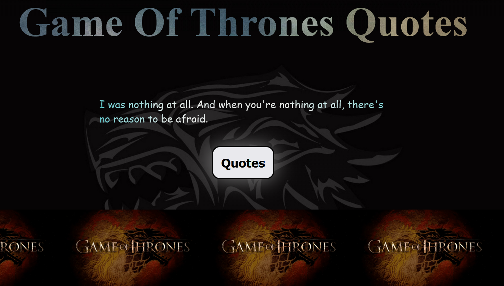

## Github Layout project

**Description**
- This mini project is to create a responsive eventUpdatePage
  Using Html,css,Bootstrap.

 **Softwares**
1. Vs code
2. Bootstrap Libraries.
3. Fontawsome Icon.

**Netlify** ApiEndpoint="https://eventupdatepage-miniproject.netlify.app"
**Output**

